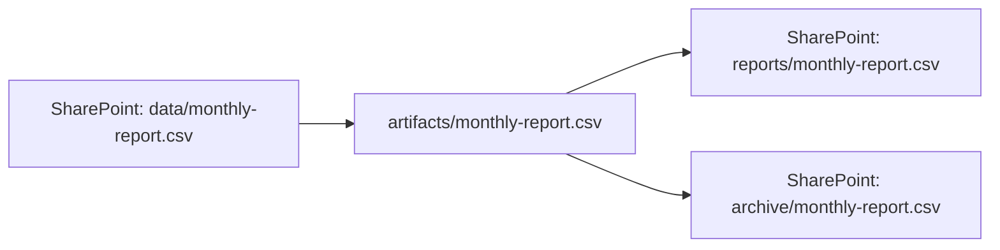
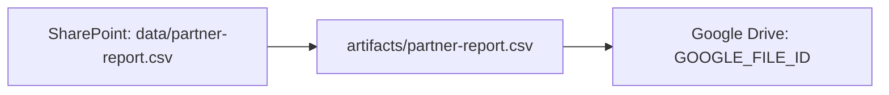
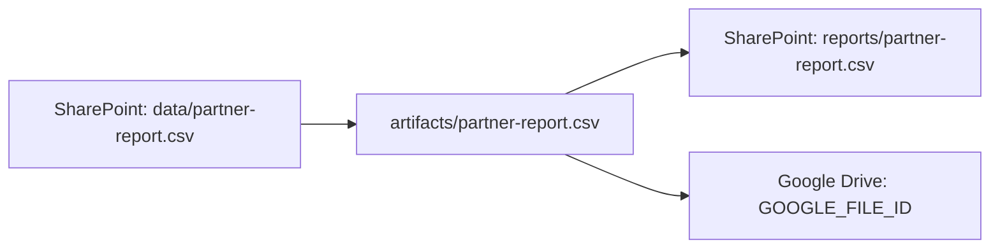
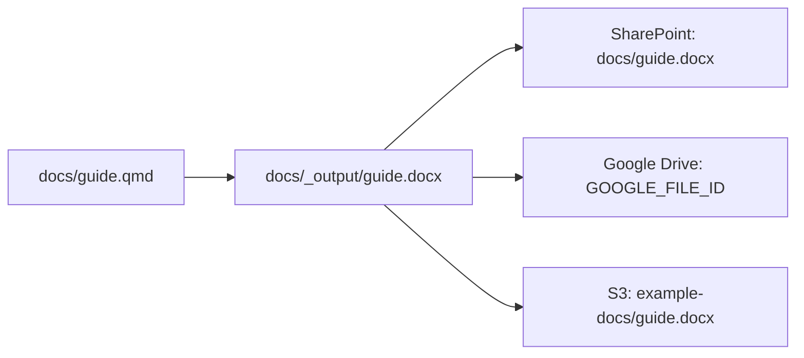

# Use cases

Each resource has one local artifact `path`. `sources` describe where it
came from; `targets` describe every intended publication destination.
`pull` downloads **one remote source** to `path`, and `push` uploads
`path` to **all targets**. Run those commands as separate steps.

The YAML blocks below and their Mermaid diagrams are generated from the
descriptors in `examples/use-cases/`. Copy a saved descriptor into your
project's `config/fileroute.yaml` and replace the example URLs to adapt it.

## One SharePoint source and two SharePoint targets

Retrieve a report, then publish copies to two SharePoint sites. This is a
supported end-to-end transfer if credentials grant access to all sites.

<!-- example:sharepoint-two-targets:start -->
```yaml
resources:
  - name: monthly-report
    path: artifacts/monthly-report.csv
    sources:
      - path: https://contoso.sharepoint.com/sites/data/Shared%20Documents/monthly-report.csv
    targets:
      - path: https://contoso.sharepoint.com/sites/reports/Shared%20Documents/monthly-report.csv
      - path: https://contoso.sharepoint.com/sites/archive/Shared%20Documents/monthly-report.csv
```
<!-- example:sharepoint-two-targets:end -->

<!-- diagram:sharepoint-two-targets:start -->

<!-- diagram:sharepoint-two-targets:end -->

```bash
uvx fileroute pull config/fileroute.yaml --dry-run
uvx fileroute pull config/fileroute.yaml
uvx fileroute push config/fileroute.yaml --dry-run
uvx fileroute push config/fileroute.yaml
```

## SharePoint source and Google Drive target

Record retrieval from SharePoint and the intended Google Drive destination.
The Google Drive target is metadata only until upload support exists.

<!-- example:sharepoint-google-drive:start -->
```yaml
resources:
  - name: partner-report
    path: artifacts/partner-report.csv
    sources:
      - path: https://contoso.sharepoint.com/sites/data/Shared%20Documents/partner-report.csv
    targets:
      - path: https://drive.google.com/file/d/GOOGLE_FILE_ID/view
```
<!-- example:sharepoint-google-drive:end -->

<!-- diagram:sharepoint-google-drive:start -->

<!-- diagram:sharepoint-google-drive:end -->

## SharePoint source, SharePoint and Google Drive targets

One artifact can declare both destinations. `push` does **not** publish just
the SharePoint copy: an unsupported target makes the whole plan fail.

<!-- example:sharepoint-mixed-targets:start -->
```yaml
resources:
  - name: partner-report
    path: artifacts/partner-report.csv
    sources:
      - path: https://contoso.sharepoint.com/sites/data/Shared%20Documents/partner-report.csv
    targets:
      - path: https://contoso.sharepoint.com/sites/reports/Shared%20Documents/partner-report.csv
      - path: https://drive.google.com/file/d/GOOGLE_FILE_ID/view
```
<!-- example:sharepoint-mixed-targets:end -->

<!-- diagram:sharepoint-mixed-targets:start -->

<!-- diagram:sharepoint-mixed-targets:end -->

## Local authoring source, three remote targets

Render `docs/guide.qmd` to `docs/_output/guide.docx` with Quarto first.
The local source is provenance; `pull` neither copies nor renders it.

<!-- example:local-three-targets:start -->
```yaml
resources:
  - name: guide
    path: docs/_output/guide.docx
    sources:
      - path: docs/guide.qmd
    targets:
      - path: https://contoso.sharepoint.com/sites/docs/Shared%20Documents/guide.docx
      - path: https://drive.google.com/file/d/GOOGLE_FILE_ID/view
      - path: s3://example-docs/guide.docx
```
<!-- example:local-three-targets:end -->

<!-- diagram:local-three-targets:start -->

<!-- diagram:local-three-targets:end -->

**Current support:** SharePoint, Google Drive, and S3 remote sources can be
pulled; only SharePoint targets can be pushed. The last three descriptors
can be resolved and diagrammed, but any `push`, including `--dry-run`,
rejects unsupported targets during planning. For immediate publication,
put supported targets in a separate descriptor.

To regenerate and check these blocks after editing a saved descriptor:

```bash
poe docs-update
poe docs-check
```

See [Transfers](transfers.md) for inheritance and execution details and
[Descriptor diagrams](diagram.md) for SVG, HTML, and Markdown output.
