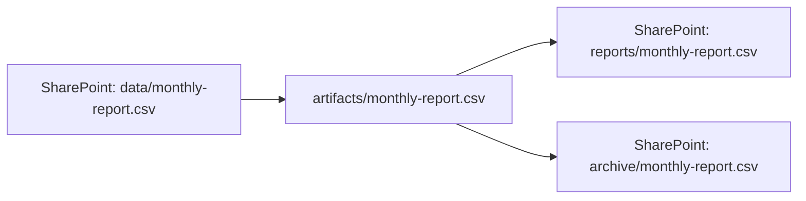
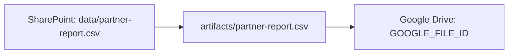
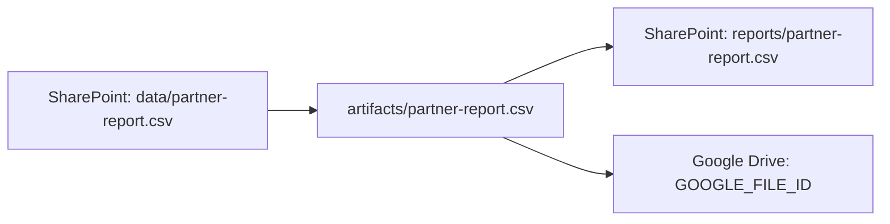
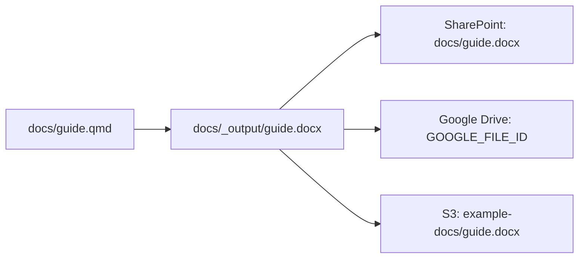
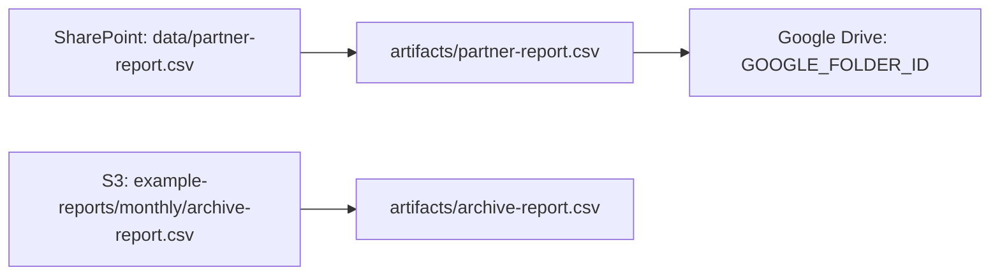

# Use cases

Each resource has one local artifact `path`. `sources` describe where it
came from; `targets` describe every intended publication destination.
`pull` downloads **one remote source** to `path`, and `push` uploads
`path` to **all targets**. Run those commands as separate steps.

The YAML blocks below and their Mermaid diagrams are generated from the
descriptors in `examples/use-cases/`. Copy a saved descriptor into your
project's `config/fileroute.yaml` and replace the example URLs to adapt it.

## One SharePoint source and two SharePoint targets

Retrieve a report, then publish copies to two SharePoint sites. This is a
supported end-to-end transfer if credentials grant access to all sites.

<!-- example:sharepoint-two-targets:start -->
```yaml
resources:
  monthly-report:
    path: artifacts/monthly-report.csv
    sources:
      - path: https://contoso.sharepoint.com/sites/data/Shared%20Documents/monthly-report.csv
    targets:
      - path: https://contoso.sharepoint.com/sites/reports/Shared%20Documents/monthly-report.csv
      - path: https://contoso.sharepoint.com/sites/archive/Shared%20Documents/monthly-report.csv
```
<!-- example:sharepoint-two-targets:end -->

<!-- diagram:sharepoint-two-targets:start -->

```mermaid
flowchart LR
    n0["artifacts/monthly-report.csv"]
    n1["SharePoint: data/monthly-report.csv"]
    n2["SharePoint: reports/monthly-report.csv"]
    n3["SharePoint: archive/monthly-report.csv"]
    n1 --> n0
    n0 --> n2
    n0 --> n3
```
<!-- diagram:sharepoint-two-targets:end -->

```bash
uvx fileroute pull config/fileroute.yaml --dry-run
uvx fileroute pull config/fileroute.yaml
uvx fileroute push config/fileroute.yaml --dry-run
uvx fileroute push config/fileroute.yaml
```

## SharePoint source and Google Drive target

Retrieve from SharePoint, then replace an existing Google Drive file by its ID.
To create a new Drive file instead, target its existing folder URL.

<!-- example:sharepoint-google-drive:start -->
```yaml
resources:
  partner-report:
    path: artifacts/partner-report.csv
    sources:
      - path: https://contoso.sharepoint.com/sites/data/Shared%20Documents/partner-report.csv
    targets:
      - path: https://drive.google.com/file/d/GOOGLE_FILE_ID/view
```
<!-- example:sharepoint-google-drive:end -->

<!-- diagram:sharepoint-google-drive:start -->

```mermaid
flowchart LR
    n0["artifacts/partner-report.csv"]
    n1["SharePoint: data/partner-report.csv"]
    n2["Google Drive: GOOGLE_FILE_ID"]
    n1 --> n0
    n0 --> n2
```
<!-- diagram:sharepoint-google-drive:end -->

## SharePoint source, SharePoint and Google Drive targets

One artifact can declare both destinations. `push` publishes to both when
credentials permit access; it never deletes files outside the descriptor.

<!-- example:sharepoint-mixed-targets:start -->
```yaml
resources:
  partner-report:
    path: artifacts/partner-report.csv
    sources:
      - path: https://contoso.sharepoint.com/sites/data/Shared%20Documents/partner-report.csv
    targets:
      - path: https://contoso.sharepoint.com/sites/reports/Shared%20Documents/partner-report.csv
      - path: https://drive.google.com/file/d/GOOGLE_FILE_ID/view
```
<!-- example:sharepoint-mixed-targets:end -->

<!-- diagram:sharepoint-mixed-targets:start -->

```mermaid
flowchart LR
    n0["artifacts/partner-report.csv"]
    n1["SharePoint: data/partner-report.csv"]
    n2["SharePoint: reports/partner-report.csv"]
    n3["Google Drive: GOOGLE_FILE_ID"]
    n1 --> n0
    n0 --> n2
    n0 --> n3
```
<!-- diagram:sharepoint-mixed-targets:end -->

## Local authoring source, three remote targets

Render `docs/guide.qmd` to `docs/_output/guide.docx` with Quarto first.
The local source is provenance; `pull` neither copies nor renders it.

<!-- example:local-three-targets:start -->
```yaml
resources:
  guide:
    path: docs/_output/guide.docx
    sources:
      - path: docs/guide.qmd
    targets:
      - path: https://contoso.sharepoint.com/sites/docs/Shared%20Documents/guide.docx
      - path: https://drive.google.com/file/d/GOOGLE_FILE_ID/view
      - path: s3://example-docs/guide.docx
```
<!-- example:local-three-targets:end -->

<!-- diagram:local-three-targets:start -->

```mermaid
flowchart LR
    n0["docs/_output/guide.docx"]
    n1["docs/guide.qmd"]
    n2["SharePoint: docs/guide.docx"]
    n3["Google Drive: GOOGLE_FILE_ID"]
    n4["S3: example-docs/guide.docx"]
    n1 --> n0
    n0 --> n2
    n0 --> n3
    n0 --> n4
```
<!-- diagram:local-three-targets:end -->

**Current support:** SharePoint, Google Drive, and S3 remote sources can be
pulled; SharePoint and Google Drive targets can be pushed. The last descriptor
has an S3 target, so even `push --dry-run` rejects its entire upload plan.
To publish its supported targets, use a separate descriptor without S3.

## Separate source and target identities

Read SharePoint as `work-reader`, publish to Google Drive as `partner-writer`,
and retrieve another report through the AWS-backed `archive-reader` profile.
Configure these names locally using [Authentication](authentication.md).
The synthetic [profile template](https://github.com/mbkranz/fileroute/blob/main/examples/auth/profiles.yaml)
shows their settings. Each location selects its identity explicitly.

<!-- example:profile-identities:start -->
```yaml
resources:
  partner-report:
    path: artifacts/partner-report.csv
    sources:
      - path: https://contoso.sharepoint.com/sites/data/Shared%20Documents/partner-report.csv
        authProfile: work-reader
    targets:
      - path: https://drive.google.com/drive/folders/GOOGLE_FOLDER_ID
        authProfile: partner-writer
  archive-report:
    path: artifacts/archive-report.csv
    sources:
      - path: s3://example-reports/monthly/archive-report.csv
        authProfile: archive-reader
```
<!-- example:profile-identities:end -->

<!-- diagram:profile-identities:start -->

```mermaid
flowchart LR
    n0["artifacts/partner-report.csv"]
    n1["SharePoint: data/partner-report.csv"]
    n2["Google Drive: GOOGLE_FOLDER_ID"]
    n3["artifacts/archive-report.csv"]
    n4["S3: example-reports/monthly/archive-report.csv"]
    n1 --> n0
    n0 --> n2
    n4 --> n3
```
<!-- diagram:profile-identities:end -->

```bash
uvx fileroute pull examples/use-cases/profile-identities.yaml --dry-run
uvx fileroute resolve examples/use-cases/profile-identities.yaml
uvx fileroute auth login sharepoint --profile work-reader
uvx fileroute auth login gdrive --profile partner-writer
aws sso login --profile team-dev
uvx fileroute pull examples/use-cases/profile-identities.yaml
uvx fileroute push examples/use-cases/profile-identities.yaml --select partner-report
```

The first two commands need no credentials. Replace the synthetic URLs and
configure the profiles before running the online commands. The diagram shows
locations and transfer intent; authentication profiles do not alter file identity.

To regenerate and check these blocks after editing a saved descriptor:

```bash
poe docs-update
poe docs-check
```

See [Transfers](transfers.md) for inheritance and execution details and
[Descriptor diagrams](diagram.md) for SVG, HTML, and Markdown output.
